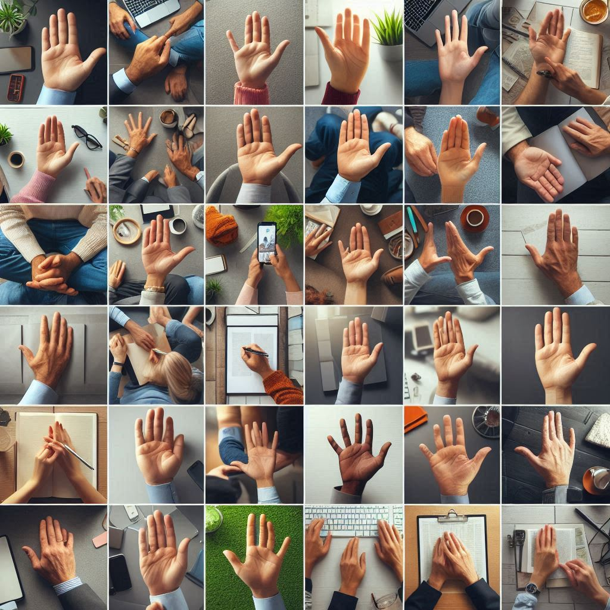
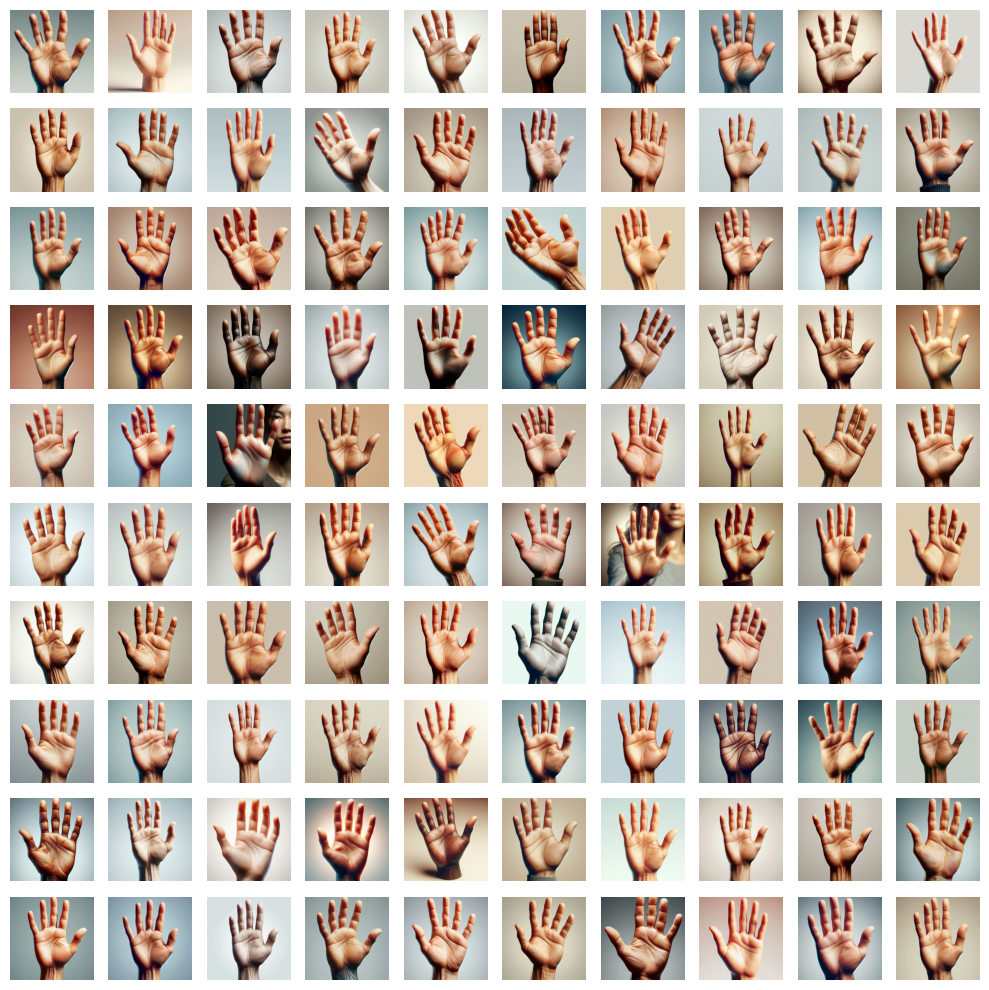

# AI Hands Datasets 🖐️

A collection of AI-generated images of hands created with [Bing Image Creator](https://www.bing.com/images/create) based on DALL-E 3.

## Annotated Datasets

All datasets are annotated in the YOLO format. The datasets also contain no labelled background images, which are needed for better training results.

### AI Hands

- **Description**: Detect hands in images.
- **Download**: [here](https://drive.google.com/uc?export=download&id=1UHeoywnQ7NDY37zOVrcWSXIU_Wpc-qWr)
- **Total images**: 214
- **Total Annotations**: 221
- **Labels**: `hand`
- **Image size**: 1024 x 1024

### AI Hands 2

- **Description**: Detect hands in images. One image has many subimages (mosaics).
- **Download**: [here](https://drive.google.com/uc?export=download&id=1UHv1IZHhMbWzB2ACwsZARftNvr2NoYa0)
- **Total images**: 6
- **Total Annotations**: 241
- **Labels**: `hand`
- **Image size**: 1024 x 1024

**Used base Text Prompt**:

```
Generate diverse images featuring humans with clearly visible hands in various poses and environments. Include people of different ages, ethnicities, and genders. Ensure hands are shown in various actions such as waving, holding objects (like a pen, phone, or book), pointing, or simply resting. The images should include hands both in motion and at rest, with varied lighting conditions and backgrounds like indoor office spaces, outdoor parks, or homes. The focus should remain on making the hands prominent for training computer vision models on hand detection.
```



### AI Open Palm

- **Description**: Detect the open palm hand gesture in images.
- **Download**: [here](https://drive.google.com/uc?export=download&id=1UJ3xIqWO1FZYf-KYSdRmoqQzSTnf_RxU)
- **Total images**: 922
- **Total Annotations**: 562
- **Labels**: `open_palm`
- **Image size**: 1024 x 1024

**Used base Text Prompt**:

```
Generate a highly realistic image of a human hand showing an open palm, as if waving. The hand should be well-lit, with natural skin tones and visible details such as lines and textures. The background should be simple and not distract from the hand gesture.
```



## Used Tools

- **AI Image Generator**: [Bing Image Creator](https://www.bing.com/images/create) based on DALL-E 3
- **Image Annotation Tool**: [CVAT (Computer Vision Annotation Tool)](https://github.com/cvat-ai/cvat) - Online or self-hosted with Docker

## Usage

These datasets are designed for training and testing computer vision models focused on hand detection and gesture recognition. They can be particularly useful for:

- Developing hand tracking systems
- Gesture-based user interfaces
- Sign language recognition
- Human-computer interaction research

## Related Repository:

- [Custom Hand Gesture Recognition Models (HGR)🖐️ with YOLOv8🚀 and MediaPipe👋 - Streamlit App](https://github.com/jk4e/my-hgr): Streamlit app with MediaPipe and Ultralytics YOLOv8 hand gesture recognition (HGR) demos using custom trained models.
- [Hands Model Zoo](https://github.com/jk4e/hands-model-zoo): A collection of pretrained models for hand gesture recognition (HGR) tasks.

## Disclaimer

This project is for educational purposes only.
